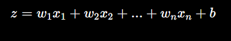
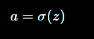
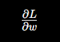
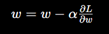

## Neural Networks (Deep Learning Core)

1.  **What is a Neural Network?**

-> A Neural Network is a system made of layers of neurons that learn patterns from data.

        Structure:

```bash
Input Layer → Hidden Layer(s) → Output Layer
```

2. **Single Neuron — Deep Understanding**

A neuron works like this:



Explanation (VERY IMPORTANT)

| Term      | Meaning                   |
| --------- | ------------------------- |
| x₁, x₂... | Inputs (features, pixels) |
| w₁, w₂... | Weights (importance)      |
| b         | Bias (adjustment)         |
| z         | Weighted sum              |

    Why this formula?

Because:

- Not all inputs are equally important
- Weights control importance
- Bias helps shift decision boundary

3. **Activation Function**

After computing z, we apply:



> Why Activation?

    Without activation:

- Model is just linear → weak

  With activation:

- Model can learn complex patterns

> Common Activation Functions

1. `ReLU (MOST IMPORTANT)`:
   ReLU is the default choice for hidden layers in modern deep networks due to its simplicity and computational efficiency

.png>)

- If x < 0 → 0
- If x > 0 → x

In word,
Behavior: Returns if, otherwise returns.

✔ Fast
✔ Works best in CNNs

2. Sigmoid (for probability)

.png>)

Output between 0 and 1

4. **Full Neural Network Flow**

```bash
Input → Weighted Sum → Activation → Output
```

For multiple layers:

```bash
Layer 1 → Layer 2 → Layer 3 → Output
```

5. **Forward Propagation**

This is the prediction step

Steps:

- Input goes in
- Multiply with weights
- Add bias
- Apply activation
- Get output

6. **Loss Function (Error)**

We measure how wrong the model is:

.png>)

Explanation

| Term | Meaning         |
| ---- | --------------- |
| y    | True value      |
| ŷ    | Predicted value |

    Bigger difference → bigger error

7. **Backpropagation (MOST IMPORTANT)**

This is how the model learns

We compute gradients:



What does this mean?

- It tells:

  “If I change weight slightly, how will loss change?”

8. **Weight Update Rule**



Explanation

| Term  | Meaning       |
| ----- | ------------- |
| α     | Learning rate |
| ∂L/∂w | Gradient      |

    Move weights to reduce error

9. **Full Training Cycle**

```bash
Forward → Loss → Backprop → Update → Repeat
```

This loop runs thousands of times

10. **Why Neural Networks Are Powerful**

Because they:

- Learn non-linear relationships
- Handle complex data (images, video)
- Improve with more data

11. **Connection to Your CCTV Project**

| Component     | Meaning            |
| ------------- | ------------------ |
| Input         | Image frame        |
| Hidden Layers | Feature extraction |
| Output        | Human / No Human   |

12. **Important Problems (Real Research Insight)**

You should know these:

> Overfitting

- Model memorizes data
- Fails on new data

> Underfitting

- Model too simple

13. **What Comes Next (VERY IMPORTANT)**

Now you understand:

- Neural network basics
- Math behind learning
- How training works
